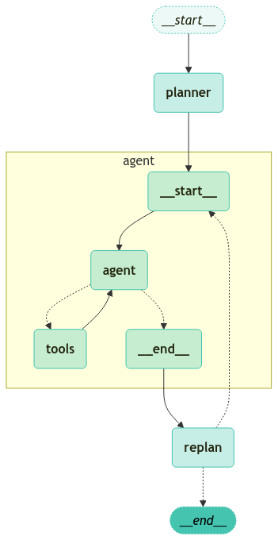
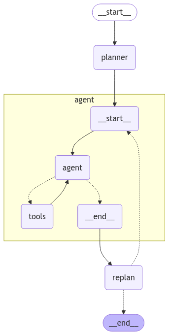

# Plan-and-Execute (계획-및-실행)

이 노트북은 "plan-and-execute (계획-및-실행)" 스타일의 에이전트(agent)를 만드는 방법을 보여줍니다. 이는 [Plan-and-Solve](https://arxiv.org/abs/2305.04091) 논문과 [Baby-AGI](https://github.com/yoheinakajima/babyagi) 프로젝트에서 많은 영감을 받았습니다.

핵심 아이디어는 먼저 다단계 계획(multi-step plan)을 세우고, 그 계획을 한 번에 하나씩 실행하는 것입니다. 특정 작업을 완료한 후에는 계획을 다시 검토하고 적절하게 수정할 수 있습니다.

일반적인 계산 그래프(computational graph)는 다음과 같습니다.


이는 한 번에 한 단계씩 생각하는 일반적인 [ReAct](https://arxiv.org/abs/2210.03629) 스타일의 에이전트와 비교됩니다. "plan-and-execute (계획-및-실행)" 스타일 에이전트의 장점은 다음과 같습니다.

1. 명시적인 장기 계획 (Explicit long term planning) (매우 강력한 LLM조차도 어려움을 겪을 수 있음)
2. 실행 단계에서는 더 작고/약한 모델을 사용하고, 계획 단계에서는 더 크고/더 나은 모델을 사용할 수 있는 능력

다음 연습에서는 LangGraph에서 이를 수행하는 방법을 보여줍니다. 결과 에이전트는 다음 예와 같은 추적을 남깁니다. ([link](https://smith.langchain.com/public/d46e24d3-dda6-44d5-9550-b618fca4e0d4/r)).

<details>
    <summary>REACT VS PLAN AND EXECUTE</summary>
안녕하세요! 구글 엔지니어로서 Agentic Workflow에서 React 방식과 Plan and Execute 방식의 차이점을 비교 설명해 드리겠습니다.

Agentic Workflow는 AI 에이전트를 활용하여 복잡한 작업을 자동화하는 방식입니다. 여기서 React 방식과 Plan and Execute 방식은 에이전트가 작업을 처리하는 방식에 차이가 있습니다.

**1. React 방식**

*   **특징:**
    *   **반응형:** 외부 자극(예: 사용자 입력, 이벤트)에 즉각적으로 반응하여 작업을 수행합니다.
    *   **단기적:** 현재 상황에 대한 즉각적인 대응에 초점을 맞춥니다.
    *   **단순 작업:** 비교적 간단하고 명확한 작업에 적합합니다.
*   **장점:**
    *   **빠른 응답:** 즉각적인 피드백이 필요한 작업에 유리합니다.
    *   **구현 용이:** 비교적 간단하게 구현할 수 있습니다.
*   **단점:**
    *   **복잡한 작업에 부적합:** 장기적인 계획이나 복잡한 추론이 필요한 작업에는 한계가 있습니다.
    *   **상황 의존적:** 현재 상황에 지나치게 의존하여 일관성이 떨어질 수 있습니다.
*   **예시:** 챗봇에서 간단한 질문에 답변하는 경우, 특정 이벤트에 따라 알림을 보내는 경우

**2. Plan and Execute 방식**

*   **특징:**
    *   **계획 기반:** 주어진 목표를 달성하기 위한 계획을 먼저 수립하고, 그 계획에 따라 작업을 실행합니다.
    *   **장기적:** 전체적인 목표 달성을 위한 장기적인 관점을 가집니다.
    *   **복잡한 작업:** 복잡한 추론, 의사 결정, 여러 단계의 작업이 필요한 경우에 적합합니다.
*   **장점:**
    *   **복잡한 작업 처리:** 복잡하고 다양한 단계를 포함하는 작업에 효과적입니다.
    *   **목표 지향적:** 명확한 목표를 설정하고 체계적으로 달성할 수 있습니다.
    *   **유연성:** 계획을 수정하거나 새로운 정보를 반영하여 작업 방식을 조정할 수 있습니다.
*   **단점:**
    *   **구현 복잡:** 계획 수립 및 실행 메커니즘이 복잡하여 구현이 어려울 수 있습니다.
    *   **시간 소요:** 계획 수립 단계에서 시간이 소요될 수 있습니다.
*   **예시:**
    *   **여행 계획:** 사용자의 요구사항(예: 여행 기간, 예산, 선호하는 활동)을 바탕으로 여행 계획을 수립하고, 예약, 교통편, 숙소 등을 자동으로 예약합니다.
    *   **연구 보고서 작성:** 주어진 주제에 대한 연구 계획을 세우고, 필요한 자료를 수집, 분석하여 보고서를 작성합니다.

**요약**

| 구분           | React 방식                               | Plan and Execute 방식                               |
| -------------- | ---------------------------------------- | --------------------------------------------------- |
| **작업 방식**   | 즉각적인 반응                             | 계획 수립 후 실행                                   |
| **시간 관점**   | 단기적                                   | 장기적                                             |
| **작업 복잡도** | 단순                                     | 복잡                                               |
| **장점**       | 빠른 응답, 구현 용이                       | 복잡한 작업 처리, 목표 지향적, 유연성                 |
| **단점**       | 복잡한 작업에 부적합, 상황 의존적             | 구현 복잡, 시간 소요                                 |
| **적합한 작업** | 챗봇 응답, 이벤트 알림                       | 여행 계획, 연구 보고서 작성                           |

Agentic Workflow를 구축할 때 작업의 특성과 목표에 따라 적절한 방식을 선택하는 것이 중요합니다. 간단하고 즉각적인 응답이 필요한 작업에는 React 방식을, 복잡하고 장기적인 계획이 필요한 작업에는 Plan and Execute 방식을 사용하는 것이 효율적입니다.

참고로, 에이전틱 워크플로우의 핵심 구성 요소로는 RPA(Robotic Process Automation), NLP(Natural Language Processing), AI 에이전트, 워크플로우 오케스트레이션, 통합 등이 있습니다. 이러한 요소들이 시너지를 창출하여 역동적인 자동화 프로세스를 구축합니다 [https://www.automationanywhere.com/rpa/agentic-workflows](https://www.automationanywhere.com/rpa/agentic-workflows).

궁금한 점이 있다면 언제든지 다시 질문해주세요!


</details>


## Setup

First, we need to install the packages required.


```python
%%capture --no-stderr
%pip install --quiet -U langgraph langchain-community langchain-openai tavily-python
```

Next, we need to set API keys for OpenAI (the LLM we will use) and Tavily (the search tool we will use)


```python
import getpass
import os


def _set_env(var: str):
    if not os.environ.get(var):
        os.environ[var] = getpass.getpass(f"{var}: ")


# _set_env("OPENAI_API_KEY")
_set_env("TAVILY_API_KEY")
```

<div class="admonition tip">
    <p class="admonition-title">Set up <a href="https://smith.langchain.com">LangSmith</a> for LangGraph development</p>
    <p style="padding-top: 5px;">
        Sign up for LangSmith to quickly spot issues and improve the performance of your LangGraph projects. LangSmith lets you use trace data to debug, test, and monitor your LLM apps built with LangGraph — read more about how to get started <a href="https://docs.smith.langchain.com">here</a>. 
    </p>
</div>

## 도구 정의 (Define Tools)

먼저 사용할 도구를 정의합니다. 이 간단한 예제에서는 Tavily를 통해 내장된 검색 도구를 사용합니다. 그러나 사용자 정의 도구를 만드는 것은 매우 쉽습니다. 자세한 내용은 [여기](https://python.langchain.com/docs/how_to/custom_tools)의 설명서를 참조하십시오.


```python
from langchain_community.tools.tavily_search import TavilySearchResults

tools = [TavilySearchResults(max_results=3)]
```

## 실행 에이전트 정의 (Define our Execution Agent)

이제 작업을 실행하는 데 사용할 실행 에이전트 (execution agent)를 생성합니다. 이 예제에서는 각 작업에 대해 동일한 실행 에이전트를 사용하지만, 반드시 그래야 하는 것은 아닙니다.


```python
from langchain import hub
# from langchain_openai import ChatOpenAI
from langchain_google_genai import ChatGoogleGenerativeAI

from langgraph.prebuilt import create_react_agent

# Choose the LLM that will drive the agent
# llm = ChatOpenAI(model="gpt-4-turbo-preview")
llm = ChatGoogleGenerativeAI(model="gemini-2.0-flash-001")
prompt = "You are a helpful assistant."
agent_executor = create_react_agent(llm, tools, prompt=prompt)
```


```python
agent_executor.invoke({"messages": [("user", "who is the winnner of the us open")]})
```


    {'messages': [HumanMessage(content='who is the winnner of the us open', additional_kwargs={}, response_metadata={}, id='02ab161c-1561-451b-bbac-e98fa3563c0d'),
      AIMessage(content='', additional_kwargs={'function_call': {'name': 'tavily_search_results_json', 'arguments': '{"query": "who won the 2023 US Open"}'}}, response_metadata={'prompt_feedback': {'block_reason': 0, 'safety_ratings': []}, 'finish_reason': 'STOP', 'safety_ratings': []}, id='run-1d180837-c58c-4eaf-aa08-1e2921aeeefd-0', tool_calls=[{'name': 'tavily_search_results_json', 'args': {'query': 'who won the 2023 US Open'}, 'id': 'd4106966-571b-4395-990c-f630aa089e78', 'type': 'tool_call'}], usage_metadata={'input_tokens': 63, 'output_tokens': 19, 'total_tokens': 82, 'input_token_details': {'cache_read': 0}}),
      ToolMessage(content='[{"url": "https://en.wikipedia.org/wiki/2023_US_Open_%E2%80%93_Men%27s_singles", "content": "Novak Djokovic defeated Daniil Medvedev in the final, 6–3, 7–6(7–5), 6–3 to win the men\'s singles tennis title at the 2023 US Open. 7   7    Stefanos Tsitsipas 4,580   10  45  4,615   Second round lost to  Dominic Stricker [Q] 11  11   Karen Khachanov    2,845   720 10  2,135   First round lost to  Michael Mmoh [WC] 13  13   Alex de Minaur 2,595   90  180 2,685   Fourth round lost to  Daniil Medvedev [3] 18  18   Lorenzo Musetti    2,005   90  10  1,925   First round lost to  Titouan Droguet [Q] 20  20   Francisco Cerúndolo    1,600   10  45  1,635   Second round lost to  Jiří Veselý [PR] 28  30   Christopher Eubanks    1,338   70  45  1,313   Second round lost to  Benjamin Bonzi [WC]"}, {"url": "https://en.wikipedia.org/wiki/2023_U.S._Open_(golf)", "content": "Wyndham Clark, who had never finished better than 75th in a major championship and had missed the cut in his previous two U.S. Opens, shot a final-round 70 to finish at 10-under-par for the tournament and hold off four-time major champion Rory McIlroy by one shot for his first career U.S. Open and major championship.[2] Wyndham Clark shot an even-par 70 to win his first career U.S. Open and major championship.[23] Beginning the round tied with Rickie Fowler for the lead, he hit his approach shot on the par-3 fourth hole to five feet for a birdie to get to 11-under and take sole possession of the lead."}, {"url": "https://www.youtube.com/watch?v=ToOaMWnlAQk", "content": "The moment Novak Djokovic beat Daniil Medvedev in the final of the 2023 US Open. #Shorts Don\'t miss a moment of the US Open!"}]', name='tavily_search_results_json', id='f84087ff-2476-4249-94b8-e3aad3386d88', tool_call_id='d4106966-571b-4395-990c-f630aa089e78', artifact={'query': 'who won the 2023 US Open', 'follow_up_questions': None, 'answer': None, 'images': [], 'results': [{'url': 'https://en.wikipedia.org/wiki/2023_US_Open_%E2%80%93_Men%27s_singles', 'title': "2023 US Open – Men's singles - Wikipedia", 'content': "Novak Djokovic defeated Daniil Medvedev in the final, 6–3, 7–6(7–5), 6–3 to win the men's singles tennis title at the 2023 US Open. 7   7    Stefanos Tsitsipas 4,580   10  45  4,615   Second round lost to  Dominic Stricker [Q] 11  11   Karen Khachanov    2,845   720 10  2,135   First round lost to  Michael Mmoh [WC] 13  13   Alex de Minaur 2,595   90  180 2,685   Fourth round lost to  Daniil Medvedev [3] 18  18   Lorenzo Musetti    2,005   90  10  1,925   First round lost to  Titouan Droguet [Q] 20  20   Francisco Cerúndolo    1,600   10  45  1,635   Second round lost to  Jiří Veselý [PR] 28  30   Christopher Eubanks    1,338   70  45  1,313   Second round lost to  Benjamin Bonzi [WC]", 'score': 0.9138076, 'raw_content': None}, {'url': 'https://en.wikipedia.org/wiki/2023_U.S._Open_(golf)', 'title': '2023 U.S. Open (golf) - Wikipedia', 'content': 'Wyndham Clark, who had never finished better than 75th in a major championship and had missed the cut in his previous two U.S. Opens, shot a final-round 70 to finish at 10-under-par for the tournament and hold off four-time major champion Rory McIlroy by one shot for his first career U.S. Open and major championship.[2] Wyndham Clark shot an even-par 70 to win his first career U.S. Open and major championship.[23] Beginning the round tied with Rickie Fowler for the lead, he hit his approach shot on the par-3 fourth hole to five feet for a birdie to get to 11-under and take sole possession of the lead.', 'score': 0.8386933, 'raw_content': None}, {'url': 'https://www.youtube.com/watch?v=ToOaMWnlAQk', 'title': 'NOVAK DJOKOVIC WINS THE US OPEN - YouTube', 'content': "The moment Novak Djokovic beat Daniil Medvedev in the final of the 2023 US Open. #Shorts Don't miss a moment of the US Open!", 'score': 0.82728493, 'raw_content': None}], 'response_time': 1.44}),
      AIMessage(content="Novak Djokovic defeated Daniil Medvedev in the final to win the men's singles tennis title at the 2023 US Open.", additional_kwargs={}, response_metadata={'prompt_feedback': {'block_reason': 0, 'safety_ratings': []}, 'finish_reason': 'STOP', 'safety_ratings': []}, id='run-b8002b85-f076-46f9-9306-f5081781439b-0', usage_metadata={'input_tokens': 661, 'output_tokens': 30, 'total_tokens': 691, 'input_token_details': {'cache_read': 0}})]}


```python

```

## 상태 정의 (Define the State)

이제 이 에이전트의 상태 (state)를 추적하기 위한 정의를 시작해 보겠습니다.

첫째, 현재 계획 (plan)을 추적해야 합니다. 계획은 문자열 목록 (list of strings)으로 나타냅니다.

다음으로, 이전에 실행된 단계 (step)를 추적해야 합니다. 단계는 튜플 목록 (list of tuples)으로 나타냅니다 (이 튜플은 단계와 결과 (result)를 포함합니다).

마지막으로, 최종 응답 (final response)과 원래 입력 (original input)을 나타내는 상태가 필요합니다.


```python
import operator
from typing import Annotated, List, Tuple
from typing_extensions import TypedDict


class PlanExecute(TypedDict):
    input: str
    plan: List[str]
    past_steps: Annotated[List[Tuple], operator.add]
    response: str
```

## 계획 단계 (Planning Step)

이제 계획 단계 (planning step)를 만드는 것에 대해 생각해 보겠습니다. 이는 함수 호출 (function calling)을 사용하여 계획 (plan)을 생성합니다.


```python
from pydantic import BaseModel, Field


class Plan(BaseModel):
    """Plan to follow in future"""

    steps: List[str] = Field(
        description="different steps to follow, should be in sorted order"
    )
```

<div class="admonition note">
    <p class="admonition-title">Pydantic과 LangChain 사용 (Using Pydantic with LangChain)</p>
    <p>
        이 노트북은 Pydantic v2 <code>BaseModel</code>을 사용하며, 이는 <code>langchain-core >= 0.3</code>을 필요로 합니다. <code>langchain-core < 0.3</code>을 사용하면 Pydantic v1과 v2 <code>BaseModel</code>의 혼용으로 인해 오류가 발생할 수 있습니다.
    </p>
</div>


```python
from langchain_core.prompts import ChatPromptTemplate

planner_prompt = ChatPromptTemplate.from_messages(
    [
        (
#    """주어진 목표에 대해 간단한 단계별 계획(step by step plan)을 세우세요. \
# 이 계획은 개별 작업(individual tasks)을 포함해야 하며, 올바르게 실행되면 정확한 답변을 얻을 수 있습니다. 불필요한 단계는 추가하지 마세요. \
# 마지막 단계의 결과는 최종 답변이어야 합니다. 각 단계에 필요한 모든 정보가 있는지 확인하고 단계를 건너뛰지 마세요.""",
            "system",
            """For the given objective, come up with a simple step by step plan. \
This plan should involve individual tasks, that if executed correctly will yield the correct answer. Do not add any superfluous steps. \
The result of the final step should be the final answer. Make sure that each step has all the information needed - do not skip steps.""",
        ),
        ("placeholder", "{messages}"),
    ]
)
# planner = planner_prompt | ChatOpenAI(
#     model="gpt-4o", temperature=0
# ).with_structured_output(Plan)
planner = planner_prompt | ChatGoogleGenerativeAI(
    model="gemini-2.0-flash-001", temperature=0
).with_structured_output(Plan)
```


```python
planner.invoke(
    {
        "messages": [
            ("user", "what is the hometown of the current Australia open winner?")
        ]
    }
)
```


    Plan(steps=['Find the current Australian Open winner.', 'Find the hometown of the current Australian Open winner.'])


## 재계획 단계 (Re-Plan Step)

이제 이전 단계의 결과를 바탕으로 계획을 다시 세우는 단계를 만들어 보겠습니다.


```python
from typing import Union


class Response(BaseModel):
    """Response to user."""

    response: str


class Act(BaseModel):
    """Action to perform."""
# description="수행할 액션(Action)입니다. 사용자에게 응답하려면 Response를 사용하십시오. "
        # "답변을 얻기 위해 도구(tools)를 추가로 사용해야 하는 경우, Plan을 사용하십시오."
    action: Union[Response, Plan] = Field(
        description="Action to perform. If you want to respond to user, use Response. "
        "If you need to further use tools to get the answer, use Plan."
    )

#     """주어진 목표에 대해 간단한 단계별 계획을 세우십시오. \
# 이 계획은 올바르게 실행될 경우 정확한 답변을 얻을 수 있는 개별 작업(individual tasks)을 포함해야 합니다. 불필요한 단계를 추가하지 마십시오. \
# 마지막 단계의 결과는 최종 답변이어야 합니다. 각 단계에 필요한 모든 정보가 있는지 확인하고 단계를 건너뛰지 마십시오.

# 당신의 목표는 다음과 같습니다:
# {input}

# 당신의 원래 계획은 다음과 같습니다:
# {plan}

# 현재까지 수행한 단계는 다음과 같습니다:
# {past_steps}

# 계획을 적절히 업데이트하십시오. 더 이상 필요한 단계가 없고 사용자에게 응답할 수 있는 경우, 그렇게 응답하십시오. 그렇지 않으면 계획을 작성하십시오. 아직 수행해야 할 단계만 계획에 추가하십시오. 이전에 완료한 단계를 계획의 일부로 반환하지 마십시오."""
replanner_prompt = ChatPromptTemplate.from_template(
    """For the given objective, come up with a simple step by step plan. \
This plan should involve individual tasks, that if executed correctly will yield the correct answer. Do not add any superfluous steps. \
The result of the final step should be the final answer. Make sure that each step has all the information needed - do not skip steps.

Your objective was this:
{input}

Your original plan was this:
{plan}

You have currently done the follow steps:
{past_steps}

Update your plan accordingly. If no more steps are needed and you can return to the user, then respond with that. Otherwise, fill out the plan. Only add steps to the plan that still NEED to be done. Do not return previously done steps as part of the plan."""
)


# replanner = replanner_prompt | ChatOpenAI(
#     model="gpt-4o", temperature=0
# ).with_structured_output(Act)
replanner = replanner_prompt | ChatGoogleGenerativeAI(
    model="gemini-2.0-flash-001", temperature=0
).with_structured_output(Act)
```

## Create the Graph

We can now create the graph!


```python
from typing import Literal
from langgraph.graph import END


async def execute_step(state: PlanExecute):
    plan = state["plan"]
    plan_str = "\n".join(f"{i+1}. {step}" for i, step in enumerate(plan))
    task = plan[0]
    task_formatted = f"""For the following plan:
{plan_str}\n\nYou are tasked with executing step {1}, {task}."""
    agent_response = await agent_executor.ainvoke(
        {"messages": [("user", task_formatted)]}
    )
    return {
        "past_steps": [(task, agent_response["messages"][-1].content)],
    }


async def plan_step(state: PlanExecute):
    plan = await planner.ainvoke({"messages": [("user", state["input"])]})
    return {"plan": plan.steps}


async def replan_step(state: PlanExecute):
    output = await replanner.ainvoke(state)
    if isinstance(output.action, Response):
        return {"response": output.action.response}
    else:
        return {"plan": output.action.steps}


def should_end(state: PlanExecute):
    if "response" in state and state["response"]:
        return END
    else:
        return "agent"
```


```python
from langgraph.graph import StateGraph, START

workflow = StateGraph(PlanExecute)

# Add the plan node
workflow.add_node("planner", plan_step)

# Add the execution step
workflow.add_node("agent", execute_step)

# Add a replan node
workflow.add_node("replan", replan_step)

workflow.add_edge(START, "planner")

# From plan we go to agent
workflow.add_edge("planner", "agent")

# From agent, we replan
workflow.add_edge("agent", "replan")

workflow.add_conditional_edges(
    "replan",
    # Next, we pass in the function that will determine which node is called next.
    should_end,
    ["agent", END],
)

# Finally, we compile it!
# This compiles it into a LangChain Runnable,
# meaning you can use it as you would any other runnable
app = workflow.compile()
```


```python
from langchain_teddynote.graphs import visualize_graph

visualize_graph(app, xray=True)
```


    

    


```python
from IPython.display import Image, display

display(Image(app.get_graph(xray=True).draw_mermaid_png()))
```


    

    


```python
config = {"recursion_limit": 50}
inputs = {"input": "what is the hometown of the mens 2024 Australia open winner?"}
async for event in app.astream(inputs, config=config):
    for k, v in event.items():
        if k != "__end__":
            print(v)
```

    {'plan': ["Find the winner of the 2024 Australian Open Men's final.", 'Find the hometown of the winner.']}
    {'past_steps': [("Find the winner of the 2024 Australian Open Men's final.", "Jannik Sinner won the 2024 Australian Open Men's final.")]}
    {'response': "Jannik Sinner won the 2024 Australian Open Men's final. His hometown is San Candido, Italy."}


```python
# from langchain_teddynote.messages import invoke_graph, random_uuid, stream_graph
# from langchain_core.runnables import RunnableConfig

# # config = RunnableConfig(recursion_limit=100, configurable={"thread_id": random_uuid()})
# # config = {"configurable": {"thread_id": "abc123"}}
# config = {"recursion_limit": 50}


# inputs = {"input": "what is the hometown of the mens 2024 Australia open winner?"}

# # inputs = {"messages": [("human", "what is the hometown of the mens 2024 Australia open winner?")]}    
    
# invoke_graph(app, inputs, config)
# # stream_graph(app, inputs, config, ['planner'])
```

## 결론

Plan-and-execute 에이전트를 만드신 것을 축하드립니다! 위 디자인의 알려진 한 가지 제한 사항은 각 작업이 여전히 순차적으로 실행된다는 점입니다. 즉, 당황스러울 정도로 병렬적인 작업들이 모두 총 실행 시간에 추가됩니다. 각 작업을 일반 목록이 아닌 DAG(LLMCompiler와 유사)로 표현하여 이를 개선할 수 있습니다.
