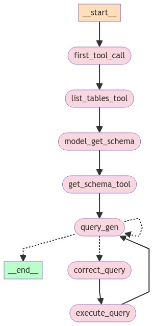
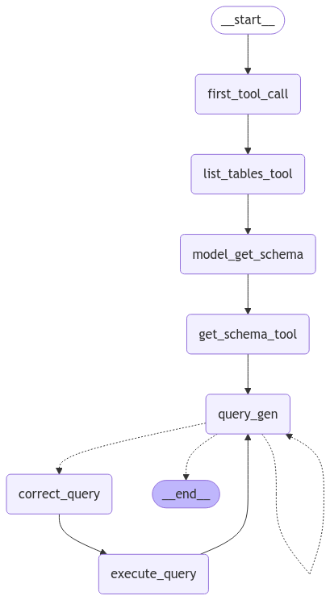

# SQL 데이터베이스와 상호 작용하는 에이전트

이 튜토리얼에서는 SQL 데이터베이스에 대한 질문에 답변할 수 있는 에이전트를 구축하는 방법을 단계별로 안내합니다.

개략적으로 에이전트는 다음을 수행합니다.
1. 데이터베이스에서 사용 가능한 테이블을 가져옵니다 (Fetch).
2. 질문과 관련된 테이블을 결정합니다 (Decide).
3. 관련 테이블에 대한 DDL (Data Definition Language)을 가져옵니다 (Fetch).
4. 질문과 DDL의 정보를 기반으로 쿼리를 생성합니다 (Generate).
5. LLM (Large Language Model)을 사용하여 일반적인 오류가 있는지 쿼리를 다시 확인합니다 (Double-check).
6. 쿼리를 실행하고 결과를 반환합니다 (Execute).
7. 쿼리가 성공할 때까지 데이터베이스 엔진에서 발견된 오류를 수정합니다 (Correct).
8. 결과를 기반으로 응답을 작성합니다 (Formulate).

엔드 투 엔드 (end-to-end) 워크플로우는 다음과 같습니다.



## Setup

First let's install our required packages and set our API keys


```python
# %%capture --no-stderr
# %pip install -U langgraph langchain_openai langchain_community
```


```python
# import getpass
# import os


# def _set_env(key: str):
#     if key not in os.environ:
#         os.environ[key] = getpass.getpass(f"{key}:")


# _set_env("OPENAI_API_KEY")
```


```python
# import langchain

# langchain.debug = True
```

<div class="admonition tip">
    <p class="admonition-title">Set up <a href="https://smith.langchain.com">LangSmith</a> for LangGraph development</p>
    <p style="padding-top: 5px;">
        Sign up for LangSmith to quickly spot issues and improve the performance of your LangGraph projects. LangSmith lets you use trace data to debug, test, and monitor your LLM apps built with LangGraph — read more about how to get started <a href="https://docs.smith.langchain.com">here</a>. 
    </p>
</div>

## 데이터베이스 설정 (Configure the database)

이 튜토리얼에서는 SQLite 데이터베이스를 생성합니다. SQLite는 설정 및 사용이 간편한 경량 데이터베이스입니다. 디지털 미디어 스토어를 나타내는 샘플 데이터베이스인 `chinook` 데이터베이스를 로드합니다.
데이터베이스에 대한 자세한 내용은 [여기](https://www.sqlitetutorial.net/sqlite-sample-database/)에서 확인할 수 있습니다.

편의를 위해 데이터베이스 (`Chinook.db`)를 퍼블릭 GCS 버킷에 호스팅했습니다.


```python
import requests

url = "https://storage.googleapis.com/benchmarks-artifacts/chinook/Chinook.db"

response = requests.get(url)

if response.status_code == 200:
    # Open a local file in binary write mode
    with open("Chinook.db", "wb") as file:
        # Write the content of the response (the file) to the local file
        file.write(response.content)
    print("File downloaded and saved as Chinook.db")
else:
    print(f"Failed to download the file. Status code: {response.status_code}")
```

    File downloaded and saved as Chinook.db


데이터베이스와 상호 작용하기 위해 `langchain_community` 패키지에서 제공하는 편리한 SQL 데이터베이스 래퍼(wrapper)를 사용할 것입니다. 이 래퍼는 SQL 쿼리(query)를 실행하고 결과를 가져오는 간단한 인터페이스(interface)를 제공합니다. 튜토리얼(tutorial) 후반부에서는 언어 모델(language model)을 위해 OpenAI API와 상호 작용하기 위해 `langchain_openai` 패키지도 사용할 것입니다.


```python
# %%capture --no-stderr --no-display
# !pip install langgraph langchain_community langchain_openai
```


```python
from langchain_community.utilities import SQLDatabase

db = SQLDatabase.from_uri("sqlite:///Chinook.db")
print(db.dialect)
print(db.get_usable_table_names())
db.run("SELECT * FROM Artist LIMIT 10;")
```

    sqlite
    ['Album', 'Artist', 'Customer', 'Employee', 'Genre', 'Invoice', 'InvoiceLine', 'MediaType', 'Playlist', 'PlaylistTrack', 'Track']


    "[(1, 'AC/DC'), (2, 'Accept'), (3, 'Aerosmith'), (4, 'Alanis Morissette'), (5, 'Alice In Chains'), (6, 'Antônio Carlos Jobim'), (7, 'Apocalyptica'), (8, 'Audioslave'), (9, 'BackBeat'), (10, 'Billy Cobham')]"


```python
db.run("SELECT c.Country, SUM(i.Total) AS TotalSpent FROM Invoice i JOIN Customer c ON i.CustomerId = c.CustomerId WHERE STRFTIME('%Y', i.InvoiceDate) = '2009' GROUP BY c.Country ORDER BY TotalSpent DESC LIMIT 1")
```


    "[('USA', 103.95)]"


## 유틸리티 함수 (Utility functions)

에이전트 구현을 돕기 위해 몇 가지 유틸리티 함수를 정의할 것입니다. 특히, 오류를 처리하고 에이전트에게 표시하기 위해 `ToolNode`를 폴백(fallback)으로 래핑(wrap)할 것입니다.


```python
from typing import Any

from langchain_core.messages import ToolMessage
from langchain_core.runnables import RunnableLambda, RunnableWithFallbacks
from langgraph.prebuilt import ToolNode


def create_tool_node_with_fallback(tools: list) -> RunnableWithFallbacks[Any, dict]:
    """
    Create a ToolNode with a fallback to handle errors and surface them to the agent.
    """
    return ToolNode(tools).with_fallbacks(
        [RunnableLambda(handle_tool_error)], exception_key="error"
    )


def handle_tool_error(state) -> dict:
    error = state.get("error")
    tool_calls = state["messages"][-1].tool_calls
    return {
        "messages": [
            ToolMessage(
                content=f"Error: {repr(error)}\n please fix your mistakes.",
                tool_call_id=tc["id"],
            )
            for tc in tool_calls
        ]
    }
```

## 에이전트를 위한 도구 정의 (Define tools for the agent)

에이전트가 데이터베이스와 상호 작용하는 데 사용할 몇 가지 도구를 정의합니다.

1. `list_tables_tool`: 데이터베이스에서 사용 가능한 테이블을 가져옵니다 (Fetch).
2. `get_schema_tool`: 테이블에 대한 DDL (Data Definition Language)을 가져옵니다 (Fetch).
3. `db_query_tool`: 쿼리 (query)를 실행하고 결과를 가져오거나 (Fetch), 쿼리가 실패할 경우 오류 메시지를 반환합니다.

처음 두 도구의 경우, `langchain_community` 패키지에서 사용할 수 있는 `SQLDatabaseToolkit`에서 가져옵니다.


```python
from langchain_community.agent_toolkits import SQLDatabaseToolkit
# from langchain_openai import ChatOpenAI
from langchain_google_genai import ChatGoogleGenerativeAI

# toolkit = SQLDatabaseToolkit(db=db, llm=ChatOpenAI(model="gpt-4o"))
toolkit = SQLDatabaseToolkit(db=db, llm=ChatGoogleGenerativeAI(model="gemini-2.0-flash-001"))
tools = toolkit.get_tools()

list_tables_tool = next(tool for tool in tools if tool.name == "sql_db_list_tables")
get_schema_tool = next(tool for tool in tools if tool.name == "sql_db_schema")

print(list_tables_tool.invoke(""))

```

    Album, Artist, Customer, Employee, Genre, Invoice, InvoiceLine, MediaType, Playlist, PlaylistTrack, Track


```python

print(get_schema_tool.invoke("Artist"))
```

    
    CREATE TABLE "Artist" (
    	"ArtistId" INTEGER NOT NULL, 
    	"Name" NVARCHAR(120), 
    	PRIMARY KEY ("ArtistId")
    )
    
    /*
    3 rows from Artist table:
    ArtistId	Name
    1	AC/DC
    2	Accept
    3	Aerosmith
    */


```python
print(tools)
```

    [QuerySQLDatabaseTool(description="Input to this tool is a detailed and correct SQL query, output is a result from the database. If the query is not correct, an error message will be returned. If an error is returned, rewrite the query, check the query, and try again. If you encounter an issue with Unknown column 'xxxx' in 'field list', use sql_db_schema to query the correct table fields.", db=<langchain_community.utilities.sql_database.SQLDatabase object at 0x10ee6f1d0>), InfoSQLDatabaseTool(description='Input to this tool is a comma-separated list of tables, output is the schema and sample rows for those tables. Be sure that the tables actually exist by calling sql_db_list_tables first! Example Input: table1, table2, table3', db=<langchain_community.utilities.sql_database.SQLDatabase object at 0x10ee6f1d0>), ListSQLDatabaseTool(db=<langchain_community.utilities.sql_database.SQLDatabase object at 0x10ee6f1d0>), QuerySQLCheckerTool(description='Use this tool to double check if your query is correct before executing it. Always use this tool before executing a query with sql_db_query!', db=<langchain_community.utilities.sql_database.SQLDatabase object at 0x10ee6f1d0>, llm=ChatGoogleGenerativeAI(model='models/gemini-2.0-flash-001', google_api_key=SecretStr('**********'), client=<google.ai.generativelanguage_v1beta.services.generative_service.client.GenerativeServiceClient object at 0x11d175350>, default_metadata=()), llm_chain=LLMChain(verbose=False, prompt=PromptTemplate(input_variables=['dialect', 'query'], input_types={}, partial_variables={}, template='\n{query}\nDouble check the {dialect} query above for common mistakes, including:\n- Using NOT IN with NULL values\n- Using UNION when UNION ALL should have been used\n- Using BETWEEN for exclusive ranges\n- Data type mismatch in predicates\n- Properly quoting identifiers\n- Using the correct number of arguments for functions\n- Casting to the correct data type\n- Using the proper columns for joins\n\nIf there are any of the above mistakes, rewrite the query. If there are no mistakes, just reproduce the original query.\n\nOutput the final SQL query only.\n\nSQL Query: '), llm=ChatGoogleGenerativeAI(model='models/gemini-2.0-flash-001', google_api_key=SecretStr('**********'), client=<google.ai.generativelanguage_v1beta.services.generative_service.client.GenerativeServiceClient object at 0x11d175350>, default_metadata=()), output_parser=StrOutputParser(), llm_kwargs={}))]


```python
print(get_schema_tool.invoke("Invoice"))
```

    
    CREATE TABLE "Invoice" (
    	"InvoiceId" INTEGER NOT NULL, 
    	"CustomerId" INTEGER NOT NULL, 
    	"InvoiceDate" DATETIME NOT NULL, 
    	"BillingAddress" NVARCHAR(70), 
    	"BillingCity" NVARCHAR(40), 
    	"BillingState" NVARCHAR(40), 
    	"BillingCountry" NVARCHAR(40), 
    	"BillingPostalCode" NVARCHAR(10), 
    	"Total" NUMERIC(10, 2) NOT NULL, 
    	PRIMARY KEY ("InvoiceId"), 
    	FOREIGN KEY("CustomerId") REFERENCES "Customer" ("CustomerId")
    )
    
    /*
    3 rows from Invoice table:
    InvoiceId	CustomerId	InvoiceDate	BillingAddress	BillingCity	BillingState	BillingCountry	BillingPostalCode	Total
    1	2	2009-01-01 00:00:00	Theodor-Heuss-Straße 34	Stuttgart	None	Germany	70174	1.98
    2	4	2009-01-02 00:00:00	Ullevålsveien 14	Oslo	None	Norway	0171	3.96
    3	8	2009-01-03 00:00:00	Grétrystraat 63	Brussels	None	Belgium	1000	5.94
    */


세 번째 도구는 수동으로 정의됩니다. `db_query_tool`의 경우, 데이터베이스에 대해 쿼리 (query)를 실행하고 결과를 반환합니다.


```python
from langchain_core.tools import tool


@tool
def db_query_tool(query: str) -> str:
    """
    Execute a SQL query against the database and get back the result.
    If the query is not correct, an error message will be returned.
    If an error is returned, rewrite the query, check the query, and try again.
    """
    result = db.run_no_throw(query)
    if not result:
        return "Error: Query failed. Please rewrite your query and try again."
    return result


print(db_query_tool.invoke("SELECT * FROM Artist LIMIT 10;"))
```

    [(1, 'AC/DC'), (2, 'Accept'), (3, 'Aerosmith'), (4, 'Alanis Morissette'), (5, 'Alice In Chains'), (6, 'Antônio Carlos Jobim'), (7, 'Apocalyptica'), (8, 'Audioslave'), (9, 'BackBeat'), (10, 'Billy Cobham')]


엄밀히 말하면 도구 (tool)는 아니지만, 쿼리 (query)에서 흔히 발생하는 실수를 점검하기 위해 LLM에 프롬프트 (prompt)를 보내고 나중에 워크플로 (workflow)에 노드 (node)로 추가할 것입니다.


```python
from langchain_core.prompts import ChatPromptTemplate

# query_check_system = """당신은 세부 사항에 강한 주의력을 가진 SQL 전문가입니다.
# SQLite 쿼리에서 흔히 발생하는 실수들을 이중으로 확인하십시오. 여기에는 다음이 포함됩니다:
# - NULL (NULL) 값이 있는 NOT IN 사용
# - UNION ALL (UNION ALL)을 사용해야 할 때 UNION (UNION) 사용
# - 배타적 범위에 대해 BETWEEN (BETWEEN) 사용
# - 술어 (predicates)의 데이터 형식 불일치
# - 식별자 (identifiers)를 적절하게 인용
# - 함수에 대한 올바른 개수의 인수 사용
# - 올바른 데이터 형식으로 캐스팅
# - 조인 (joins)에 적합한 열 사용
# 위에 언급된 실수들이 있다면 쿼리를 다시 작성하십시오. 실수가 없다면 원래 쿼리를 그대로 다시 생성하십시오.
# 이 검사를 실행한 후 쿼리를 실행하기 위해 적절한 도구 (tool)를 호출할 것입니다."""

query_check_system = """You are a SQL expert with a strong attention to detail.
Double check the SQLite query for common mistakes, including:
- Using NOT IN with NULL values
- Using UNION when UNION ALL should have been used
- Using BETWEEN for exclusive ranges
- Data type mismatch in predicates
- Properly quoting identifiers
- Using the correct number of arguments for functions
- Casting to the correct data type
- Using the proper columns for joins

If there are any of the above mistakes, rewrite the query. If there are no mistakes, just reproduce the original query.

You will call the appropriate tool to execute the query after running this check."""

query_check_prompt = ChatPromptTemplate.from_messages(
    [("system", query_check_system), ("placeholder", "{messages}")]
)
# query_check = query_check_prompt | ChatOpenAI(model="gpt-4o", temperature=0).bind_tools(
#     [db_query_tool], tool_choice="required"
# )

model_name = "gemini-2.0-flash-001"

query_check = query_check_prompt | ChatGoogleGenerativeAI(model=model_name, temperature=0).bind_tools(
    [db_query_tool], tool_choice="db_query_tool"
)

query_check.invoke({"messages": [("user", "SELECT * FROM Artist LIMIT 10;")]})
```


    AIMessage(content='', additional_kwargs={'function_call': {'name': 'db_query_tool', 'arguments': '{"query": "SELECT * FROM Artist LIMIT 10;"}'}}, response_metadata={'prompt_feedback': {'block_reason': 0, 'safety_ratings': []}, 'finish_reason': 'STOP', 'safety_ratings': []}, id='run-cab7176f-2835-42aa-b648-a73f99596444-0', tool_calls=[{'name': 'db_query_tool', 'args': {'query': 'SELECT * FROM Artist LIMIT 10;'}, 'id': '6412fd33-dd8c-407d-a985-685ef055499b', 'type': 'tool_call'}], usage_metadata={'input_tokens': 193, 'output_tokens': 15, 'total_tokens': 208, 'input_token_details': {'cache_read': 0}})


## 워크플로우 정의하기 (Define the workflow)

이제 에이전트를 위한 워크플로우를 정의합니다. 에이전트는 먼저 `list_tables_tool`을 강제 호출(force-call)하여 데이터베이스에서 사용 가능한 테이블을 가져온 다음, 튜토리얼 시작 부분에서 언급한 단계를 따릅니다.

<div class="admonition note">
    <p class="admonition-title">Using Pydantic with LangChain</p>
    <p>
        This notebook uses Pydantic v2 <code>BaseModel</code>, which requires <code>langchain-core >= 0.3</code>. Using <code>langchain-core < 0.3</code> will result in errors due to mixing of Pydantic v1 and v2 <code>BaseModels</code>.
    </p>
</div>


```python
from typing import Annotated, Literal

from langchain_core.messages import AIMessage
# from langchain_openai import ChatOpenAI
from langchain_google_genai import ChatGoogleGenerativeAI
from pydantic import BaseModel, Field
from typing_extensions import TypedDict

from langgraph.graph import END, StateGraph, START
from langgraph.graph.message import AnyMessage, add_messages
from langgraph.checkpoint.memory import MemorySaver

MODEL_NAME = "gemini-2.0-flash-001"

# 에이전트의 상태 정의
class State(TypedDict):
    messages: Annotated[list[AnyMessage], add_messages]


# 새로운 그래프 정의
workflow = StateGraph(State)


# 첫 번째 도구 호출을 위한 노드 추가
def first_tool_call(state: State) -> dict[str, list[AIMessage]]:
    return {
        "messages": [
            AIMessage(
                content="",
                tool_calls=[
                    {
                        "name": "sql_db_list_tables",
                        "args": {},
                        "id": "initial_tool_call_abc123",
                    }
                ],
            )
        ]
    }


# 쿼리의 정확성을 모델로 점검하기 위한 함수 정의
def model_check_query(state: State) -> dict[str, list[AIMessage]]:
    """
    Use this tool to check that your query is correct before you run it
    """
    return {"messages": [query_check.invoke({"messages": [state["messages"][-1]]})]}


# 첫 번째 도구 호출 노드 추가
workflow.add_node("first_tool_call", first_tool_call)

# 첫 번째 두 도구를 위한 노드 추가
workflow.add_node(
    "list_tables_tool", create_tool_node_with_fallback([list_tables_tool])
)
workflow.add_node("get_schema_tool", create_tool_node_with_fallback([get_schema_tool]))

# 질문과 사용 가능한 테이블을 기반으로 관련 테이블을 선택하는 모델 노드 추가
# model_get_schema = ChatOpenAI(model=MODEL_NAME, temperature=0).bind_tools(
#     [get_schema_tool]
# )
model_get_schema = ChatGoogleGenerativeAI(model=MODEL_NAME, temperature=0).bind_tools(
    [get_schema_tool]
)
workflow.add_node(
    "model_get_schema",
    lambda state: {
        "messages": [model_get_schema.invoke(state["messages"])],
    },
)


# 최종 상태를 나타내는 도구 설명
class SubmitFinalAnswer(BaseModel):
    """쿼리 결과를 기반으로 사용자에게 최종 답변 제출"""

    final_answer: str = Field(..., description="The final answer to the user")


# 질문과 스키마를 기반으로 쿼리를 생성하기 위한 모델 노드 추가
QUERY_GEN_INSTRUCTION = """You are a SQL expert with a strong attention to detail.

You can define SQL queries, analyze queries results and interpretate query results to response an answer.

Read the messages bellow and identify the user question, table schemas, query statement and query result, or error if they exist.

1. If there's not any query result that make sense to answer the question, create a syntactically correct SQLite query to answer the user question. DO NOT make any DML statements (INSERT, UPDATE, DELETE, DROP etc.) to the database.

2. If you create a query, response ONLY the query statement. For example, "SELECT id, name FROM pets;"

3. If a query was already executed, but there was an error. Response with the same error message you found. For example: "Error: Pets table doesn't exist"

4. If a query was already executed successfully interpretate the response and answer the question following this pattern: Answer: <<question answer>>. For example: "Answer: There three cats registered as adopted"
"""

query_gen_prompt = ChatPromptTemplate.from_messages(
    [("system", QUERY_GEN_INSTRUCTION), ("placeholder", "{messages}")]
)
# query_gen = query_gen_prompt | ChatOpenAI(model=MODEL_NAME, temperature=0).bind_tools(
#     [SubmitFinalAnswer, model_check_query]
# )

query_gen = query_gen_prompt | ChatGoogleGenerativeAI(model=MODEL_NAME, temperature=0).bind_tools(
    [SubmitFinalAnswer, model_check_query]
)


# 조건부 에지 정의
def should_continue(state: State) -> Literal[END, "correct_query", "query_gen"]:
    messages = state["messages"]

    last_message = messages[-1]
    if last_message.content.startswith("Answer:"):
        return END
    if last_message.content.startswith("Error:"):
        return "query_gen"
    else:
        return "correct_query"


# 쿼리 생성 노드 정의
def query_gen_node(state: State):
    message = query_gen.invoke(state)

    # LLM이 잘못된 도구를 호출할 경우 오류 메시지를 반환
    tool_messages = []
    message.pretty_print()
    if message.tool_calls:
        for tc in message.tool_calls:
            if tc["name"] != "SubmitFinalAnswer":
                tool_messages.append(
                    ToolMessage(
                        content=f"Error: The wrong tool was called: {tc['name']}. Please fix your mistakes. Remember to only call SubmitFinalAnswer to submit the final answer. Generated queries should be outputted WITHOUT a tool call.",
                        tool_call_id=tc["id"],
                    )
                )
    else:
        tool_messages = []
    return {"messages": [message] + tool_messages}


# 쿼리 생성 노드 추가
workflow.add_node("query_gen", query_gen_node)

# 쿼리를 실행하기 전에 모델로 점검하는 노드 추가
workflow.add_node("correct_query", model_check_query)

# 쿼리를 실행하기 위한 노드 추가
workflow.add_node("execute_query", create_tool_node_with_fallback([db_query_tool]))

# 노드 간의 엣지 지정
workflow.add_edge(START, "first_tool_call")
workflow.add_edge("first_tool_call", "list_tables_tool")
workflow.add_edge("list_tables_tool", "model_get_schema")
workflow.add_edge("model_get_schema", "get_schema_tool")
workflow.add_edge("get_schema_tool", "query_gen")
workflow.add_conditional_edges(
    "query_gen",
    should_continue,
)
workflow.add_edge("correct_query", "execute_query")
workflow.add_edge("execute_query", "query_gen")

# 실행 가능한 워크플로우로 컴파일
app = workflow.compile(checkpointer=MemorySaver())
```

<details>
    <summary>Checkpointer</summary>
알겠습니다. `checkpointer=MemorySaver()`에 대해 자세히 설명해 드리겠습니다.

````docs/docs/tutorials/sql-agent_ko.ipynb
// ... 기존 코드 ...
app = workflow.compile(checkpointer=MemorySaver())
// ... 기존 코드 ...
````

`checkpointer=MemorySaver()`는 LangGraph 워크플로우의 체크포인팅(checkpointing)을 설정하는 부분입니다. 체크포인팅은 워크플로우의 중간 상태를 저장하여, 나중에 필요할 때 해당 상태에서부터 다시 시작할 수 있도록 하는 기능입니다.

*   **`checkpointer`**: 이 인자는 체크포인팅을 처리하는 객체를 지정합니다. 체크포인터는 워크플로우의 상태를 저장하고 복원하는 역할을 합니다.
*   **`MemorySaver()`**: 이는 LangGraph에서 제공하는 기본 체크포인터 중 하나로, 워크플로우의 상태를 메모리에 저장합니다. 즉, 워크플로우가 실행되는 동안의 상태가 RAM에 보관됩니다.

**장점:**

*   **간편한 설정**: 별도의 데이터베이스나 파일 시스템 설정 없이 바로 사용할 수 있습니다.
*   **빠른 속도**: 메모리에서 데이터를 읽고 쓰기 때문에 디스크 I/O보다 훨씬 빠릅니다.

**단점:**

*   **휘발성**: 메모리에 저장되므로, 워크플로우가 종료되거나 시스템이 재시작되면 저장된 상태가 모두 사라집니다. 따라서 장기적인 데이터 보관에는 적합하지 않습니다.
*   **메모리 제한**: 대규모 워크플로우의 경우, 상태를 저장하는 데 필요한 메모리 양이 많아질 수 있습니다.

**사용 시나리오:**

*   **테스트 및 디버깅**: 워크플로우의 특정 지점에서 상태를 저장하고, 오류가 발생했을 때 해당 상태로 돌아가서 디버깅할 수 있습니다.
*   **단기적인 상태 유지**: 워크플로우가 짧은 시간 동안 실행되고, 상태를 잃어도 큰 문제가 없는 경우에 사용할 수 있습니다.

**대안:**

장기적인 상태 유지를 위해서는 다음과 같은 체크포인터를 사용할 수 있습니다.

*   **`SQLiteSaver`**: SQLite 데이터베이스에 상태를 저장합니다.
*   **`FileSaver`**: 파일 시스템에 상태를 저장합니다.
*   **`RedisSaver`**: Redis 데이터베이스에 상태를 저장합니다.

이러한 체크포인터는 데이터를 디스크나 네트워크에 저장하므로, 워크플로우가 종료되거나 시스템이 재시작되어도 상태를 유지할 수 있습니다.

**요약:**

`checkpointer=MemorySaver()`는 LangGraph 워크플로우의 상태를 메모리에 저장하여 체크포인팅을 활성화하는 설정입니다. 이는 간편하고 빠르지만, 휘발성이 있으므로 장기적인 데이터 보관에는 적합하지 않습니다. 테스트 및 디버깅, 또는 단기적인 상태 유지에 유용하게 사용할 수 있습니다.

알겠습니다. `MemorySaver()`가 저장하는 정보에 대해 더 자세히 설명하겠습니다.

`MemorySaver()`는 LangGraph 워크플로우의 실행 상태를 저장하는 체크포인터로, 다음 정보들을 포함합니다.

1.  **노드 상태 (Node State)**:
    *   각 노드에서 처리된 메시지 (messages)
    *   각 노드의 입력 및 출력 데이터
    *   노드 실행 중 발생한 오류 정보

2.  **그래프 상태 (Graph State)**:
    *   현재 워크플로우의 진행 상태 (어떤 노드가 실행되었는지, 다음 실행될 노드는 무엇인지)
    *   워크플로우의 전체 메시지 히스토리 (message history)
    *   조건부 분기 (conditional branching) 정보

3.  **변수 상태 (Variable State)**:
    *   워크플로우 내에서 사용되는 변수들의 값
    *   예를 들어, 쿼리 결과, API 호출 결과 등

4.  **메타데이터 (Metadata)**:
    *   워크플로우 실행에 관련된 메타데이터 (실행 시간, 실행 ID 등)
    *   체크포인트 생성 시간

이러한 정보들은 워크플로우의 각 단계에서 생성되고 업데이트되며, `MemorySaver()`는 이 정보들을 메모리에 저장합니다. 따라서 워크플로우가 중단되거나 재시작될 때, 저장된 상태를 불러와 이전 실행 지점부터 다시 시작할 수 있습니다.

**예시:**

SQL 에이전트 예제에서 `MemorySaver()`는 다음과 같은 정보들을 저장할 수 있습니다.

*   `list_tables_tool` 노드에서 반환된 테이블 목록
*   `get_schema_tool` 노드에서 반환된 테이블 스키마
*   `query_gen` 노드에서 생성된 SQL 쿼리
*   `db_query_tool` 노드에서 실행된 쿼리 결과
*   사용자 질문 (user question)
*   에이전트의 최종 답변 (final answer)

이 정보들을 통해 에이전트는 이전 대화 내용을 기억하고, 필요한 경우 이전 단계로 돌아가서 작업을 다시 수행할 수 있습니다.

**주의:**

`MemorySaver()`는 메모리에 데이터를 저장하므로, 저장할 수 있는 데이터 양에 제한이 있습니다. 대규모 워크플로우의 경우, 메모리 부족 문제가 발생할 수 있습니다. 또한, 메모리에 저장된 데이터는 휘발성이 있으므로, 시스템이 재시작되면 데이터가 모두 사라집니다. 따라서 장기적인 데이터 보관에는 적합하지 않습니다.

</details>

## Visualize the graph


```python
from IPython.display import Image, display
from langchain_core.runnables.graph import MermaidDrawMethod

display(
    Image(
        app.get_graph().draw_mermaid_png(
            draw_method=MermaidDrawMethod.API,
        )
    )
)
```


    

    


## Run the agent


```python
from langchain_core.runnables import RunnableConfig
from langchain_teddynote.messages import random_uuid, invoke_graph, stream_graph
from langchain_core.messages import HumanMessage
```


```python
config = RunnableConfig(configurable={"thread_id": random_uuid()})

inputs = {
    "messages": [HumanMessage(content="2009년도에 어느 국가의 고객이 가장 많이 지출했을까요? 그리고 얼마를 지출했을까요? 한글로 답변하세요.")],
}
# 그래프를 실행하여 메시지 결과 조회
messages = app.invoke(inputs, config)
answer = messages["messages"][-1].content
```

    ================================== Ai Message ==================================
    
    ```sql
    SELECT
      c.Country,
      SUM(i.Total) AS TotalSpent
    FROM Invoice AS i
    JOIN Customer AS c
      ON i.CustomerId = c.CustomerId
    WHERE
      STRFTIME('%Y', i.InvoiceDate) = '2009'
    GROUP BY
      c.Country
    ORDER BY
      TotalSpent DESC
    LIMIT 1;
    ```
    ================================== Ai Message ==================================
    
    Answer: 2009년에는 USA의 고객이 총 103.95를 지출하여 가장 많은 금액을 지출했습니다.


```python
messages = app.invoke(
    {"messages": [("user", "Which sales agent made the most in sales in 2009?")]},
    config
)


# json_str = messages["messages"][-1].tool_calls[0]["args"]["final_answer"]
# json_str
```

    ================================== Ai Message ==================================
    
    ```sql
    SELECT
      e.FirstName || ' ' || e.LastName AS SalesAgent,
      SUM(i.Total) AS TotalSales
    FROM Employee AS e
    JOIN Customer AS c
      ON e.EmployeeId = c.SupportRepId
    JOIN Invoice AS i
      ON c.CustomerId = i.CustomerId
    WHERE
      STRFTIME('%Y', i.InvoiceDate) = '2009'
    GROUP BY
      SalesAgent
    ORDER BY
      TotalSales DESC
    LIMIT 1;
    ```
    ================================== Ai Message ==================================
    
    Answer: Steve Johnson made the most in sales in 2009 with a total of 164.34.


```python
messages["messages"][-1].content
```


    'Answer: Steve Johnson made the most in sales in 2009 with a total of 164.34.'


## 그래프 실행

에이전트를 실행하여 SQL 데이터베이스와 상호작용하는 전체 프로세스를 진행합니다.

에이전트는 사용자의 질문에 따라 데이터베이스에서 정보를 검색하고, 쿼리를 생성 및 실행하여 결과를 반환합니다. 


```python
from langchain_core.runnables import RunnableConfig
from langchain_teddynote.messages import random_uuid, invoke_graph, stream_graph
from langchain_core.messages import HumanMessage
from langgraph.errors import GraphRecursionError


def run_graph(
    message: str, recursive_limit: int = 30, node_names=[], stream: bool = False
):
    # config 설정(재귀 최대 횟수, thread_id)
    config = RunnableConfig(
        recursion_limit=recursive_limit, configurable={"thread_id": random_uuid()}
    )

    # 질문 입력
    inputs = {
        "messages": [HumanMessage(content=message)],
    }

    try:
        if stream:
            # 그래프 실행
            stream_graph(app, inputs, config, node_names=node_names)
        else:
            invoke_graph(app, inputs, config, node_names=node_names)
        output = app.get_state(config).values
        return output
    except GraphRecursionError as recursion_error:
        print(f"GraphRecursionError: {recursion_error}")
        output = app.get_state(config).values
        return output
```


```python
output = run_graph(
    "Andrew Adam 직원의 인적정보를 모두 조회해줘",
    stream=False,
)
```

    
    ==================================================
    🔄 Node: first_tool_call 🔄
    - - - - - - - - - - - - - - - - - - - - - - - - - 
    ================================== Ai Message ==================================
    Tool Calls:
      sql_db_list_tables (initial_tool_call_abc123)
     Call ID: initial_tool_call_abc123
      Args:
    ==================================================
    
    ==================================================
    🔄 Node: list_tables_tool 🔄
    - - - - - - - - - - - - - - - - - - - - - - - - - 
    ================================= Tool Message =================================
    Name: sql_db_list_tables
    
    Album, Artist, Customer, Employee, Genre, Invoice, InvoiceLine, MediaType, Playlist, PlaylistTrack, Track
    ==================================================
    
    ==================================================
    🔄 Node: model_get_schema 🔄
    - - - - - - - - - - - - - - - - - - - - - - - - - 
    ================================== Ai Message ==================================
    
    제가 접근할 수 있는 테이블 목록을 알려주셨습니다. 직원 정보를 찾으려면 'Employee' 테이블을 조회해야 할 것 같습니다. 'Employee' 테이블의 스키마를 알려주시겠어요?
    Tool Calls:
      sql_db_schema (1c288c97-a973-4cfd-a7cc-297198f8230f)
     Call ID: 1c288c97-a973-4cfd-a7cc-297198f8230f
      Args:
        table_names: Employee
    ==================================================
    
    ==================================================
    🔄 Node: get_schema_tool 🔄
    - - - - - - - - - - - - - - - - - - - - - - - - - 
    ================================= Tool Message =================================
    Name: sql_db_schema
    
    
    CREATE TABLE "Employee" (
    	"EmployeeId" INTEGER NOT NULL, 
    	"LastName" NVARCHAR(20) NOT NULL, 
    	"FirstName" NVARCHAR(20) NOT NULL, 
    	"Title" NVARCHAR(30), 
    	"ReportsTo" INTEGER, 
    	"BirthDate" DATETIME, 
    	"HireDate" DATETIME, 
    	"Address" NVARCHAR(70), 
    	"City" NVARCHAR(40), 
    	"State" NVARCHAR(40), 
    	"Country" NVARCHAR(40), 
    	"PostalCode" NVARCHAR(10), 
    	"Phone" NVARCHAR(24), 
    	"Fax" NVARCHAR(24), 
    	"Email" NVARCHAR(60), 
    	PRIMARY KEY ("EmployeeId"), 
    	FOREIGN KEY("ReportsTo") REFERENCES "Employee" ("EmployeeId")
    )
    
    /*
    3 rows from Employee table:
    EmployeeId	LastName	FirstName	Title	ReportsTo	BirthDate	HireDate	Address	City	State	Country	PostalCode	Phone	Fax	Email
    1	Adams	Andrew	General Manager	None	1962-02-18 00:00:00	2002-08-14 00:00:00	11120 Jasper Ave NW	Edmonton	AB	Canada	T5K 2N1	+1 (780) 428-9482	+1 (780) 428-3457	andrew@chinookcorp.com
    2	Edwards	Nancy	Sales Manager	1	1958-12-08 00:00:00	2002-05-01 00:00:00	825 8 Ave SW	Calgary	AB	Canada	T2P 2T3	+1 (403) 262-3443	+1 (403) 262-3322	nancy@chinookcorp.com
    3	Peacock	Jane	Sales Support Agent	2	1973-08-29 00:00:00	2002-04-01 00:00:00	1111 6 Ave SW	Calgary	AB	Canada	T2P 5M5	+1 (403) 262-3443	+1 (403) 262-6712	jane@chinookcorp.com
    */
    ==================================================
    ================================== Ai Message ==================================
    
    ```sql
    SELECT * FROM Employee WHERE FirstName = 'Andrew' AND LastName = 'Adams'
    ```
    
    ==================================================
    🔄 Node: query_gen 🔄
    - - - - - - - - - - - - - - - - - - - - - - - - - 
    ================================== Ai Message ==================================
    
    ```sql
    SELECT * FROM Employee WHERE FirstName = 'Andrew' AND LastName = 'Adams'
    ```
    ==================================================
    
    ==================================================
    🔄 Node: correct_query 🔄
    - - - - - - - - - - - - - - - - - - - - - - - - - 
    ================================== Ai Message ==================================
    Tool Calls:
      db_query_tool (ca622de0-d059-4ea4-9d48-b5abe56c88dd)
     Call ID: ca622de0-d059-4ea4-9d48-b5abe56c88dd
      Args:
        query: SELECT * FROM Employee WHERE FirstName = 'Andrew' AND LastName = 'Adams'
    ==================================================
    
    ==================================================
    🔄 Node: execute_query 🔄
    - - - - - - - - - - - - - - - - - - - - - - - - - 
    ================================= Tool Message =================================
    Name: db_query_tool
    
    [(1, 'Adams', 'Andrew', 'General Manager', None, '1962-02-18 00:00:00', '2002-08-14 00:00:00', '11120 Jasper Ave NW', 'Edmonton', 'AB', 'Canada', 'T5K 2N1', '+1 (780) 428-9482', '+1 (780) 428-3457', 'andrew@chinookcorp.com')]
    ==================================================
    ================================== Ai Message ==================================
    
    Answer: Andrew Adam 직원의 인적 정보는 다음과 같습니다. EmployeeId: 1, LastName: Adams, FirstName: Andrew, Title: General Manager, ReportsTo: None, BirthDate: 1962-02-18 00:00:00, HireDate: 2002-08-14 00:00:00, Address: 11120 Jasper Ave NW, City: Edmonton, State: AB, Country: Canada, PostalCode: T5K 2N1, Phone: +1 (780) 428-9482, Fax: +1 (780) 428-3457, Email: andrew@chinookcorp.com
    
    ==================================================
    🔄 Node: query_gen 🔄
    - - - - - - - - - - - - - - - - - - - - - - - - - 
    ================================== Ai Message ==================================
    
    Answer: Andrew Adam 직원의 인적 정보는 다음과 같습니다. EmployeeId: 1, LastName: Adams, FirstName: Andrew, Title: General Manager, ReportsTo: None, BirthDate: 1962-02-18 00:00:00, HireDate: 2002-08-14 00:00:00, Address: 11120 Jasper Ave NW, City: Edmonton, State: AB, Country: Canada, PostalCode: T5K 2N1, Phone: +1 (780) 428-9482, Fax: +1 (780) 428-3457, Email: andrew@chinookcorp.com
    ==================================================


```python
config = RunnableConfig(configurable={"thread_id": random_uuid()})

inputs = {
    "messages": [HumanMessage(content="2009년도에 어느 국가의 고객이 가장 많이 지출했을까요? 그리고 얼마를 지출했을까요? 한글로 답변하세요.")],
}
# 그래프를 실행하여 메시지 결과 조회
messages = app.invoke(inputs, config)
answer = messages["messages"][-1].content
```

    ================================== Ai Message ==================================
    
    ```sql
    SELECT
      c.Country,
      SUM(i.Total) AS TotalSpent
    FROM Invoice AS i
    JOIN Customer AS c
      ON i.CustomerId = c.CustomerId
    WHERE
      STRFTIME('%Y', i.InvoiceDate) = '2009'
    GROUP BY
      c.Country
    ORDER BY
      TotalSpent DESC
    LIMIT 1;
    ```
    ================================== Ai Message ==================================
    
    Answer: 2009년에는 USA의 고객이 총 103.95를 지출하여 가장 많은 금액을 지출했습니다.


```python
output = run_graph(
    "2009년도에 어느 국가의 고객이 가장 많이 지출했을까요? 그리고 얼마를 지출했을까요? 한글로 답변하세요.",
    stream=False,
)
```

    
    ==================================================
    🔄 Node: first_tool_call 🔄
    - - - - - - - - - - - - - - - - - - - - - - - - - 
    ================================== Ai Message ==================================
    Tool Calls:
      sql_db_list_tables (initial_tool_call_abc123)
     Call ID: initial_tool_call_abc123
      Args:
    ==================================================
    
    ==================================================
    🔄 Node: list_tables_tool 🔄
    - - - - - - - - - - - - - - - - - - - - - - - - - 
    ================================= Tool Message =================================
    Name: sql_db_list_tables
    
    Album, Artist, Customer, Employee, Genre, Invoice, InvoiceLine, MediaType, Playlist, PlaylistTrack, Track
    ==================================================
    
    ==================================================
    🔄 Node: model_get_schema 🔄
    - - - - - - - - - - - - - - - - - - - - - - - - - 
    ================================== Ai Message ==================================
    
    2009년도에 어느 국가의 고객이 가장 많이 지출했는지, 그리고 얼마를 지출했는지 알려면 Invoice 테이블과 Customer 테이블을 봐야 할 것 같습니다. Invoice 테이블에는 청구 정보가 있고, Customer 테이블에는 고객 정보가 있기 때문입니다. 두 테이블의 스키마를 알려주세요.
    Tool Calls:
      sql_db_schema (c06d1b75-f906-4007-88db-2d3d80c07cd4)
     Call ID: c06d1b75-f906-4007-88db-2d3d80c07cd4
      Args:
        table_names: Invoice, Customer
    ==================================================
    
    ==================================================
    🔄 Node: get_schema_tool 🔄
    - - - - - - - - - - - - - - - - - - - - - - - - - 
    ================================= Tool Message =================================
    Name: sql_db_schema
    
    
    CREATE TABLE "Customer" (
    	"CustomerId" INTEGER NOT NULL, 
    	"FirstName" NVARCHAR(40) NOT NULL, 
    	"LastName" NVARCHAR(20) NOT NULL, 
    	"Company" NVARCHAR(80), 
    	"Address" NVARCHAR(70), 
    	"City" NVARCHAR(40), 
    	"State" NVARCHAR(40), 
    	"Country" NVARCHAR(40), 
    	"PostalCode" NVARCHAR(10), 
    	"Phone" NVARCHAR(24), 
    	"Fax" NVARCHAR(24), 
    	"Email" NVARCHAR(60) NOT NULL, 
    	"SupportRepId" INTEGER, 
    	PRIMARY KEY ("CustomerId"), 
    	FOREIGN KEY("SupportRepId") REFERENCES "Employee" ("EmployeeId")
    )
    
    /*
    3 rows from Customer table:
    CustomerId	FirstName	LastName	Company	Address	City	State	Country	PostalCode	Phone	Fax	Email	SupportRepId
    1	Luís	Gonçalves	Embraer - Empresa Brasileira de Aeronáutica S.A.	Av. Brigadeiro Faria Lima, 2170	São José dos Campos	SP	Brazil	12227-000	+55 (12) 3923-5555	+55 (12) 3923-5566	luisg@embraer.com.br	3
    2	Leonie	Köhler	None	Theodor-Heuss-Straße 34	Stuttgart	None	Germany	70174	+49 0711 2842222	None	leonekohler@surfeu.de	5
    3	François	Tremblay	None	1498 rue Bélanger	Montréal	QC	Canada	H2G 1A7	+1 (514) 721-4711	None	ftremblay@gmail.com	3
    */
    
    
    CREATE TABLE "Invoice" (
    	"InvoiceId" INTEGER NOT NULL, 
    	"CustomerId" INTEGER NOT NULL, 
    	"InvoiceDate" DATETIME NOT NULL, 
    	"BillingAddress" NVARCHAR(70), 
    	"BillingCity" NVARCHAR(40), 
    	"BillingState" NVARCHAR(40), 
    	"BillingCountry" NVARCHAR(40), 
    	"BillingPostalCode" NVARCHAR(10), 
    	"Total" NUMERIC(10, 2) NOT NULL, 
    	PRIMARY KEY ("InvoiceId"), 
    	FOREIGN KEY("CustomerId") REFERENCES "Customer" ("CustomerId")
    )
    
    /*
    3 rows from Invoice table:
    InvoiceId	CustomerId	InvoiceDate	BillingAddress	BillingCity	BillingState	BillingCountry	BillingPostalCode	Total
    1	2	2009-01-01 00:00:00	Theodor-Heuss-Straße 34	Stuttgart	None	Germany	70174	1.98
    2	4	2009-01-02 00:00:00	Ullevålsveien 14	Oslo	None	Norway	0171	3.96
    3	8	2009-01-03 00:00:00	Grétrystraat 63	Brussels	None	Belgium	1000	5.94
    */
    ==================================================
    ================================== Ai Message ==================================
    
    ```sql
    SELECT
      c.Country,
      SUM(i.Total) AS TotalSpent
    FROM Invoice AS i
    JOIN Customer AS c
      ON i.CustomerId = c.CustomerId
    WHERE
      STRFTIME('%Y', i.InvoiceDate) = '2009'
    GROUP BY
      c.Country
    ORDER BY
      TotalSpent DESC
    LIMIT 1;
    ```
    
    ==================================================
    🔄 Node: query_gen 🔄
    - - - - - - - - - - - - - - - - - - - - - - - - - 
    ================================== Ai Message ==================================
    
    ```sql
    SELECT
      c.Country,
      SUM(i.Total) AS TotalSpent
    FROM Invoice AS i
    JOIN Customer AS c
      ON i.CustomerId = c.CustomerId
    WHERE
      STRFTIME('%Y', i.InvoiceDate) = '2009'
    GROUP BY
      c.Country
    ORDER BY
      TotalSpent DESC
    LIMIT 1;
    ```
    ==================================================
    
    ==================================================
    🔄 Node: correct_query 🔄
    - - - - - - - - - - - - - - - - - - - - - - - - - 
    ================================== Ai Message ==================================
    Tool Calls:
      db_query_tool (10051fe8-921d-4ef0-af84-367502c23756)
     Call ID: 10051fe8-921d-4ef0-af84-367502c23756
      Args:
        query: SELECT
      c.Country,
      SUM(i.Total) AS TotalSpent
    FROM Invoice AS i
    JOIN Customer AS c
      ON i.CustomerId = c.CustomerId
    WHERE
      STRFTIME('%Y', i.InvoiceDate) = '2009'
    GROUP BY
      c.Country
    ORDER BY
      TotalSpent DESC
    LIMIT 1;
    ==================================================
    
    ==================================================
    🔄 Node: execute_query 🔄
    - - - - - - - - - - - - - - - - - - - - - - - - - 
    ================================= Tool Message =================================
    Name: db_query_tool
    
    [('USA', 103.95)]
    ==================================================
    ================================== Ai Message ==================================
    
    Answer: 2009년에는 USA의 고객이 총 103.95를 지출하여 가장 많은 금액을 지출했습니다.
    
    ==================================================
    🔄 Node: query_gen 🔄
    - - - - - - - - - - - - - - - - - - - - - - - - - 
    ================================== Ai Message ==================================
    
    Answer: 2009년에는 USA의 고객이 총 103.95를 지출하여 가장 많은 금액을 지출했습니다.
    ==================================================
